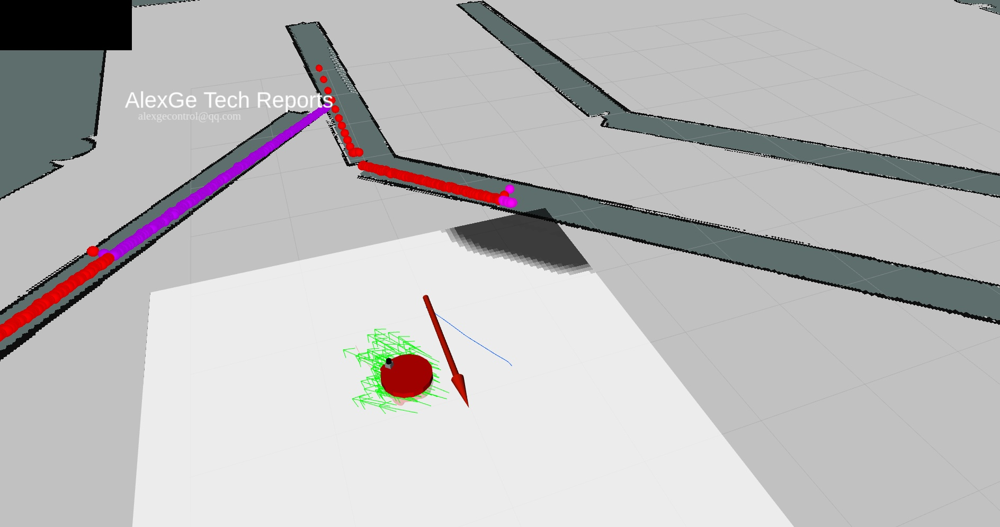

# Adaptive Monte Carlo Localization for Planer Robot with Known Map

## Environment Setup

First, fetch and compile packages in your catkin workspace.
```shell
# create workspace:
mkdir -p adaptive-monte-carlo-localization/src
cd adaptive-monte-carlo-localization/src
# fetch remote repo to your catkin workspace:
git clone https://github.com/AlexGeControl/Robotics-04-Localization-03-Adaptive-Monte-Carlo.git
# build packages:
cd ..
catkin_make
```
## Kinematics Check

To check the kinematics of your defined robot, launch the following environment and test your robot with teleop:
```shell
source devel/setup.bash
# launch world:
roslaunch sweeping_robot world.launch
# launch teleop:
roslaunch sweeping_robot teleop.launch
```

## Launch Localization
```shell
source devel/setup.bash
# launch world:
roslaunch sweeping_robot world.launch
# launch AMCL + NavStack:
roslaunch sweeping_robot amcl.launch
# launch RViz:
roslaunch sweeping_robot rviz.launch
# launch Navigation target:
rosrun sweeping_robot navigation_goal
```

## Results

Localization & Navigation on the way.

To begin, below is the initial estimation of AMCL:


After entering the corridor, the estimation began to converge:


And the robot can successfully navigate itself around the turn:


Finally it successfully reached the neighborhood of destination:




Terminal status when destination is reached:


